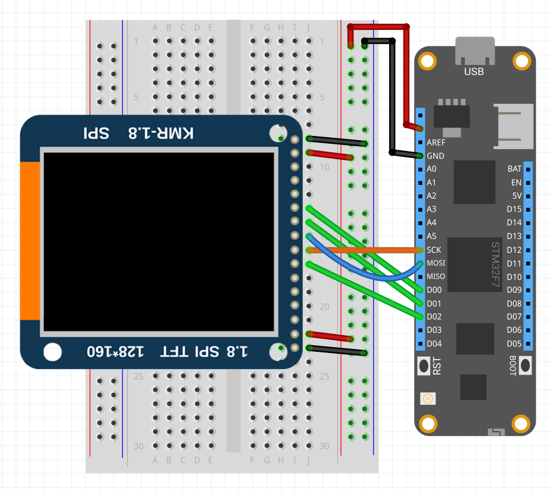

### Purchasing

You can get S6D02A1 displays from the following suppliers:

* [AliExpress]()
* [Ebay]()
* [Amazon]()

### Code Example

The following example shows how to initialize a S6D02A1 display and draw three lines using `DrawPixel` method:

```csharp
using System;
using System.Threading;
using Meadow;
using Meadow.Devices;
using Meadow.Foundation.Displays.Tft;
using Meadow.Hardware;

namespace S6D02A1_Sample
{
    public class Program
    {
        static IApp _app; 
        public static void Main()
        {
            _app = new MeadowApp();
        }
    }
    
    public class MeadowApp : AppBase<F7Micro, App>
    {
        protected ISpiBus spiBus;
        protected S6D02A1 S6D02A1;

        public MeadowApp ()
        {
            spiBus = Device.CreateSpiBus();

            S6D02A1 = new S6D02A1(
                device: Device, 
                spiBus: spiBus,
                chipSelectPin: null,
                dcPin: Device.Pins.D01,
                resetPin: Device.Pins.D00,
                width: 240, height: 240);

            Console.WriteLine("Clear display");
            S6D02A1.ClearScreen(250);
            S6D02A1.Refresh();

            Console.WriteLine("Draw lines");
            for (int i = 0; i < 30; i++)
            {
                S6D02A1.DrawPixel(i, i, true);
                S6D02A1.DrawPixel(30 + i, i, true);
                S6D02A1.DrawPixel(60 + i, i, true);
            }

            S6D02A1.Show(); 
        }
    }
}
```

### Circuit Example

 To wire a S6D02A1 to your Meadow board, connect the following:

| S6D02A1  | Meadow Pin |
|---------|------------|
| GND     | GND        |
| VCC     | 3V3        |
| SCL     | SCK        |
| SDA     | MOSI       |
| RESET   | D00        |
| DC      | D01        |

It should look like the following diagram:

